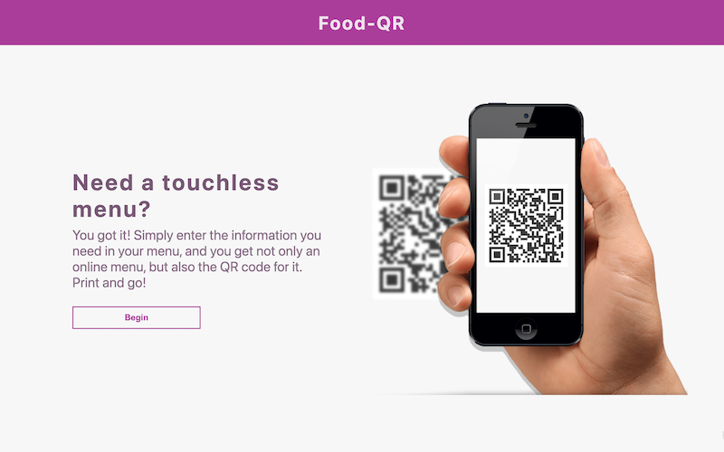
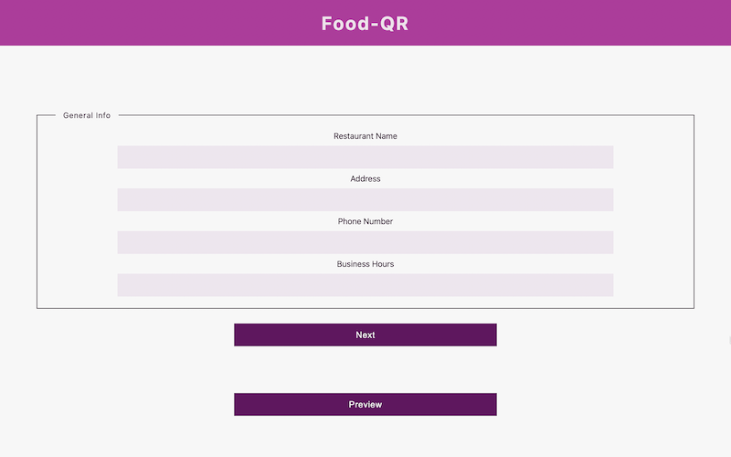
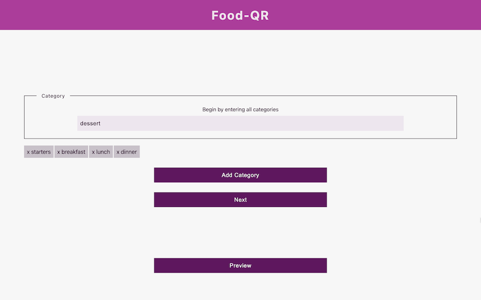
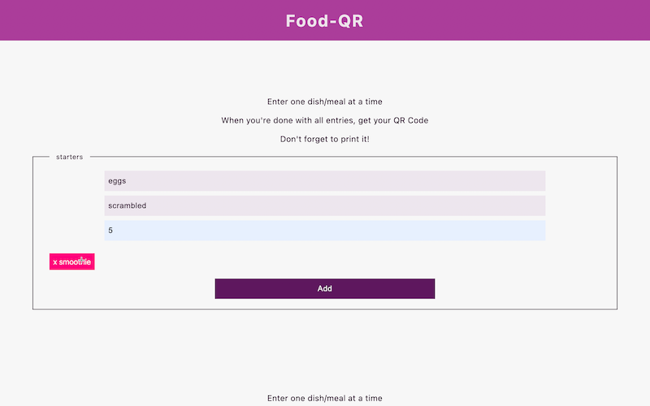

# FOOD QR TS

---

[Live App Here](https://food-qr-ts.herokuapp.com/)

---

[Live Menu Here](https://food-qr.herokuapp.com/restaurants/62c237a57755faca5964cf0a)

---

## SCAN THIS CODE FOR TEST

TypeScript version of full stack [Food-QR](https://github.com/Medic1111/FOOD-QR). App that allows a food establishment to create a standardized online menu and generates a QR Code which can be printed and used to direct to live menu touchless.

### TEST

> If you are not interested in filling out the forms, you can check an example of a live menu on the link up top

> You can test the code my scanning the code in the image above with your phone camera

> Or you can test the application from scratch:

1. Fill out entries, and get your QR Code
2. Scan it with your phone camera and click the link you will receive on the phone
3. Your menu will show up

### TECH

1. Front-end:
   - ReactJs/Typescript
2. Back-end:
   - Express
   - Node.js
3. Database:
   - MongoDB
4. Extras:
   - QRCode-react
5. Deployment:
   - Heroku

> STATUS: DEVELOPMENT

> Visual planning by exploring how the features will work once deployed

#### Considerations:

- [x] Add a preview menu
- [x] Allow for deletion/edit

#### Issues:

- [x] Fix add dish to Cat. preview

#### INSTALL

1. Download the project
2. Open the project and on the root run `npm install` then `node server/index.js`
3. On a different terminal, run `cd client`, then `npm install` and finally `npm start`
4. Create a `.env` file and add `DB_URI=your_mongo_path_here_not_in_quotes`
